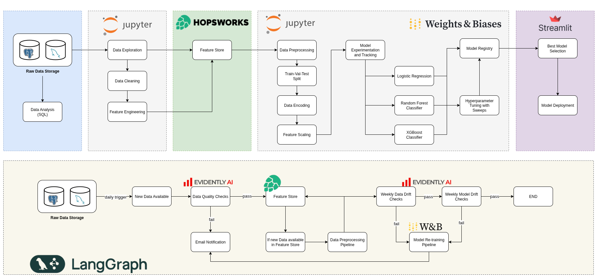
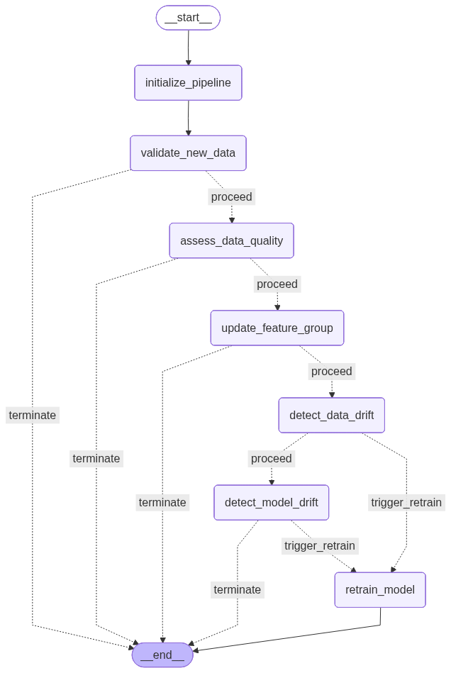
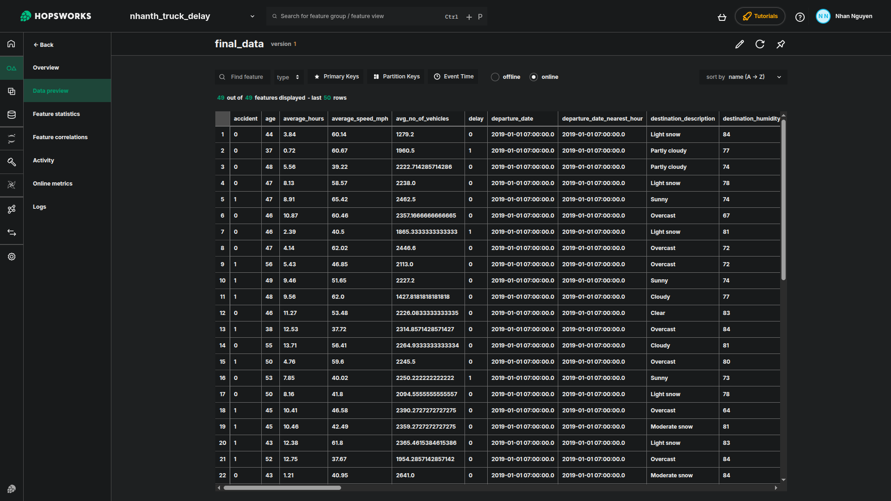
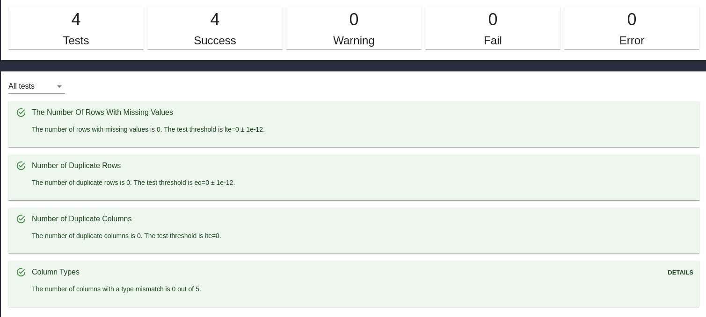
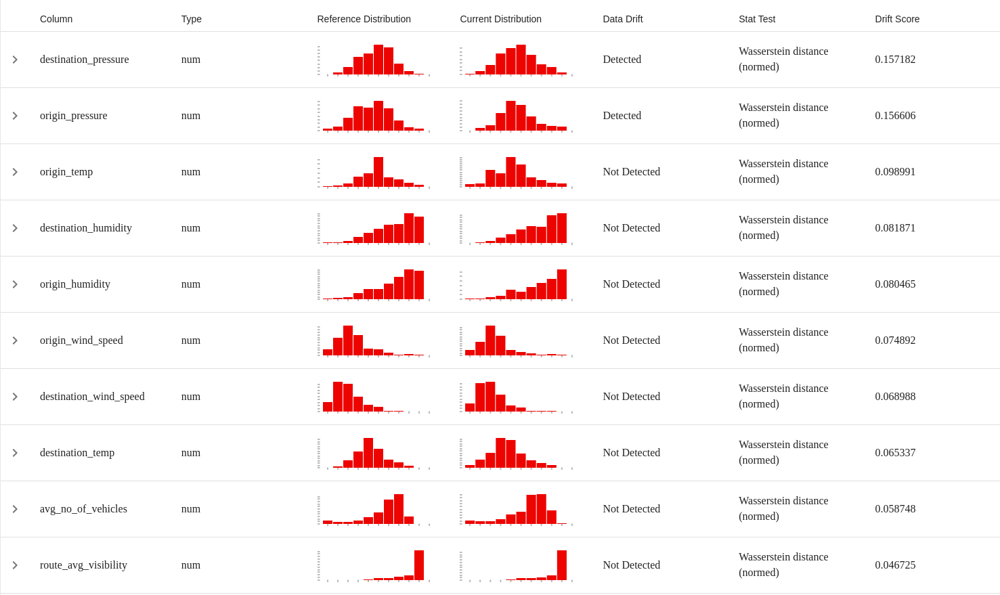
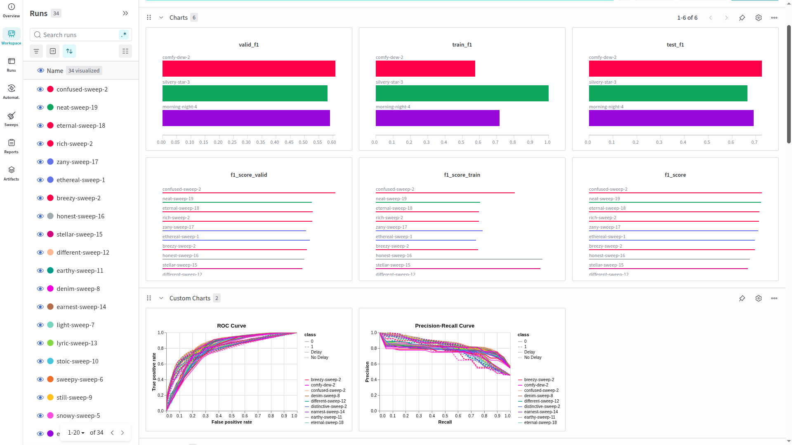
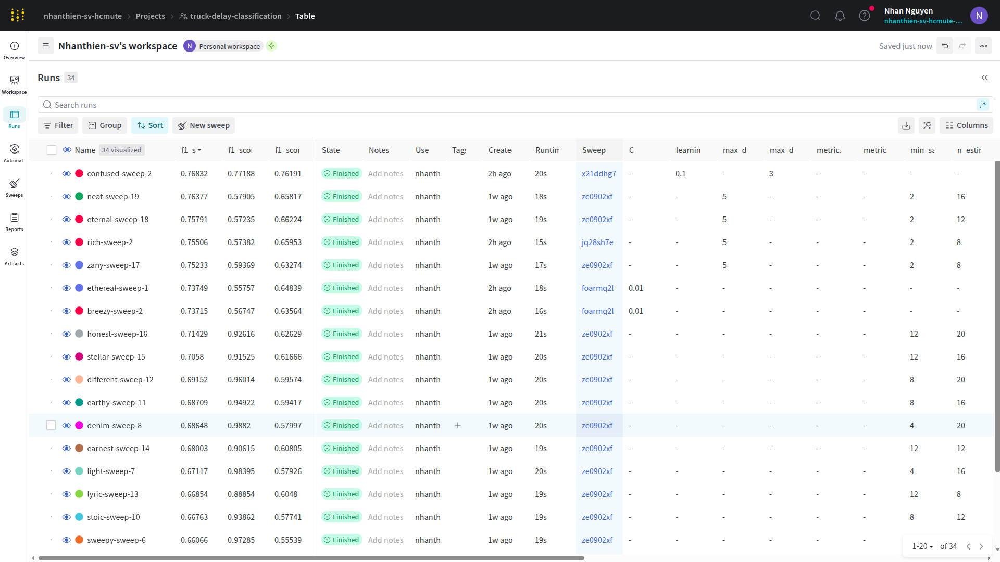

# 🚛 Truck Delay Prediction Pipeline

## 📌 Overview
This project implements an **end-to-end machine learning pipeline** for predicting truck delivery delays.  
It integrates multiple components to ensure automation, monitoring, and retraining:

- **LangGraph** – Workflow orchestration  
- **Hopsworks Feature Store** – Centralized feature management  
- **Evidently AI** – Data and model drift monitoring  
- **Weights & Biases (W&B)** – Experiment tracking, hyperparameter tuning, model registry  
- **Streamlit** – Deployment and visualization  

The pipeline automates the full lifecycle: raw data ingestion → feature engineering → model training → monitoring → retraining.

---

## 🗂️ Architecture

  
*Figure 1: End-to-end architecture from raw data → feature store → training → deployment.*

---

## 🔄 LangGraph Orchestration

The pipeline is orchestrated using **LangGraph**, with the following steps:

  
*Figure 2: LangGraph workflow for data validation, quality checks, drift detection, and retraining.*

- **initialize_pipeline** – Establish database connections, logger, and feature store.  
- **validate_new_data** – Check if new data is available.  
- **assess_data_quality** – Run **Evidently AI** checks for missing values, schema mismatch, and anomalies.  
- **update_feature_group** – Update **Hopsworks Feature Store** with validated data.  
- **detect_data_drift** – Compare last 7 days vs historical data.  
- **detect_model_drift** – Compare F1 score stability across time.  
- **retrain_model** – Trigger retraining pipeline in W&B if drift is detected.  

---

## 🏗️ Pipeline Components

### 1️⃣ Data Storage & Exploration
- Raw data stored in **Postgres & MySQL**.  
- Initial analysis performed via **SQL queries** and **pandas**.  

---

### 2️⃣ Feature Store
- **Hopsworks Feature Store** is used to:  
  - Store feature groups.  
  - Reuse features across training and inference.  

📷 *Feature Store Example:*  

---

### 3️⃣ Data Quality & Drift Monitoring
- Daily **Evidently AI** checks for data quality.  
- Weekly **drift checks** (data drift + model drift).  
- Automatic pipeline triggers if drift is detected.  

📷 *Evidently Report:*  

---

### 4️⃣ Model Training & Tracking
- Data preprocessing: encoding, scaling, splitting.  
- Models: Logistic Regression, Random Forest, XGBoost.  
- **Weights & Biases** handles:  
  - Experiment tracking  
  - Hyperparameter tuning with **Sweeps**  
  - Model registry  

📷 *W&B Dashboard:*  

---

### 5️⃣ Deployment
- Best model is selected from **W&B Model Registry**.  
- Deployment via **Streamlit** UI for predictions.  

📷 *Streamlit UI Demo:*  

---
